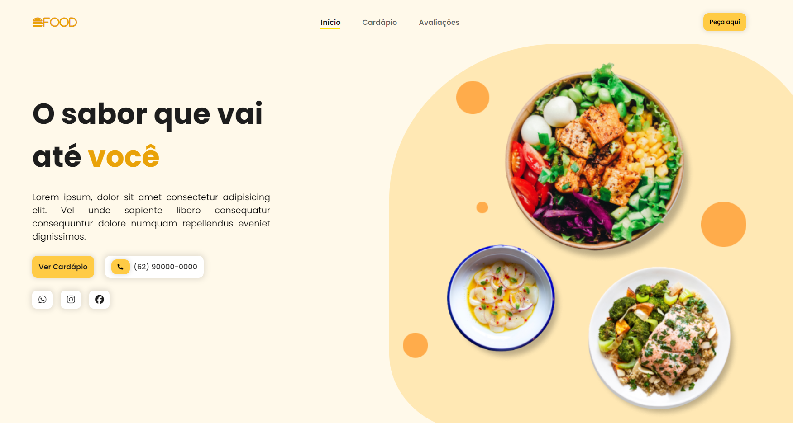

<h1 align="center">
  Landing Page - FOOD
</h1>

  <a href="#-projeto">Projeto</a>&nbsp;&nbsp;&nbsp;|&nbsp;&nbsp;&nbsp;
  <a href="#-tecnologias">Tecnologias</a>&nbsp;&nbsp;&nbsp;|&nbsp;&nbsp;&nbsp;
  <a href="#-layout">Layout</a>&nbsp;&nbsp;&nbsp;

  

## 💻 Projeto

Projeto de landing page para um restaurante, utilizando: _HTML_, _CSS_ e _JAVASCRIPT_.

## 🚀 Tecnologias

- HTML
- CSS
- [Gerar wave](https://www.softr.io/tools/svg-wave-generator)
- [Scroll Reveal](https://scrollrevealjs.org/api/reveal.html)

## 📔 Conhecimentos abordados

- [x] Uso semântico do HTML
- [x] Váriaveis do css no `:root`
- [x] Animações com a biblioteca [Scroll Reveal](https://scrollrevealjs.org/api/reveal.html)
- [x] Efeitos gerados apartir de css e javascript

## 🔖 Layout

Você pode visualizar o projeto através [DESSE LINK](https://charles-landingfood.vercel.app/).